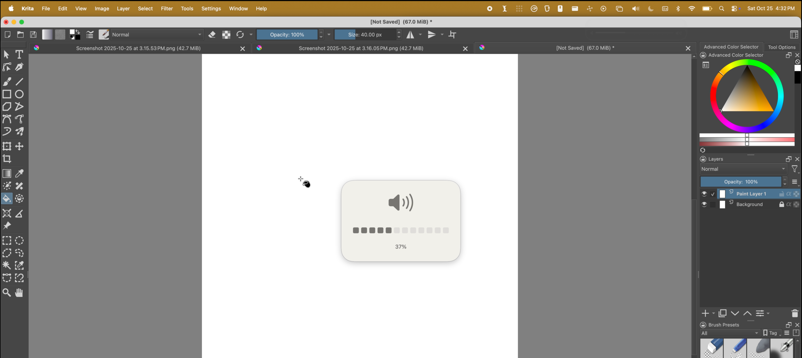

# SoundEffect 🍎





## Installation

1. Download the latest `SoundEffect-x.x.x.dmg` from [Releases](https://github.com/alimoeeny/soundeffect/releases)
2. Open the DMG and drag SoundEffect to Applications
3. Launch SoundEffect

## Requirements

- of course you need to be on macOS Tahoe, otherwise why would you need this :D

## Known Limitations

**Bluetooth Audio Devices**: AirPods and other Bluetooth devices don't expose volume changes through macOS CoreAudio APIs. This is a macOS limitation, not a bug. SoundEffect works perfectly with:
- Internal speakers
- Wired headphones
- USB audio devices

## Building from Source

```bash
# Clone the repository
git clone https://github.com/alimoeeny/soundeffect.git
cd soundeffect

# Open in Xcode
open SoundEffect.xcodeproj

# Or build from command line
xcodebuild -project SoundEffect.xcodeproj -scheme SoundEffect -configuration Release
```

## Development

Contributions, PRs, or just feedback are welcome!

**Enjoy your new volume indicator!** 🎉

[Report an issue](https://github.com/alimoeeny/soundeffect/issues) • [Request a feature](https://github.com/alimoeeny/soundeffect/issues/new)
